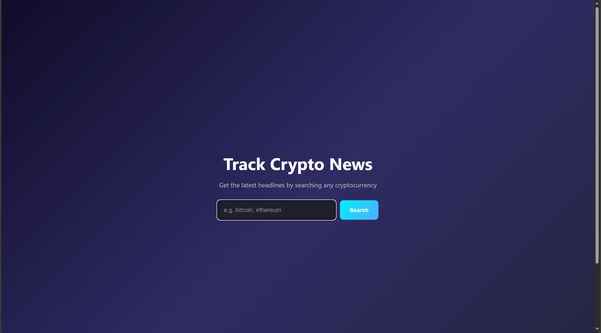
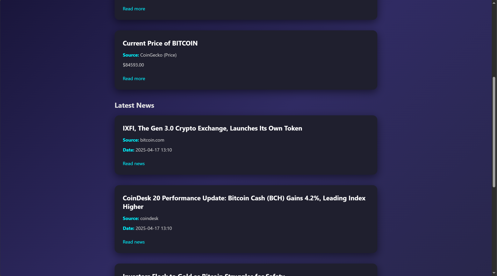

# Track Crypto News — Rust Project


A lightweight Rust web application that retrieves and displays cryptocurrency information. Enter a coin’s name or ticker symbol to get its details via the CoinGecko API — no API key required.

---

## Technologies Used

- **Language:** Rust  
- **Frameworks & Libraries:**  
  - Actix-web  
  - Reqwest  
  - Serde  
- **API:** [CoinGecko](https://www.coingecko.com/en/api)  
- **Frontend:** Basic HTML search form  
- **Project Structure:**
  ```text
  /api
  /handlers
  /models
  /utils
  ```

---

## Getting Started

1. Install [Rust](https://rustup.rs)  
2. Clone the repository:
   ```bash
   git clone https://github.com/your_username/cryptonews-aggregator.git
   cd cryptonews-aggregator
   ```
3. Run the application:
   ```bash
   cargo run
   ```
4. Open your browser and go to:
   - Home Page: [http://127.0.0.1:8080/](http://127.0.0.1:8080/)
   - Example Search: [http://127.0.0.1:8080/news/bitcoin](http://127.0.0.1:8080/news/bitcoin)

---

## Example API Response

**GET** `/news/bitcoin`  

**Response:**
```json
[
  {
    "title": "About BITCOIN",
    "source": "CoinGecko",
    "date": "N/A",
    "summary": "...",
    "url": "https://bitcoin.org"
  }
]
```

---

## Screenshots

**Home Page**  


**Bitcoin Search Result**  


---

## 📄 License

This project is licensed under the MIT License. See the [LICENSE](./LICENSE) file for details.

---

## 👥 Authors

**Daniil** & **Bauyrzhan**  
Blockchain Tech — April 2025  
